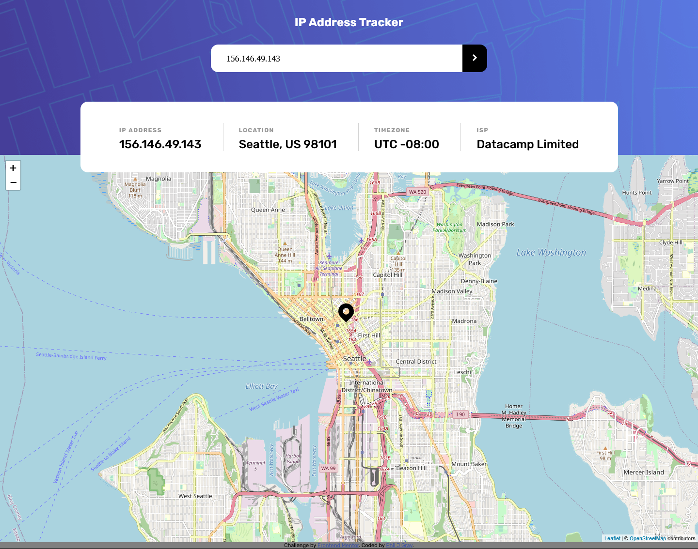
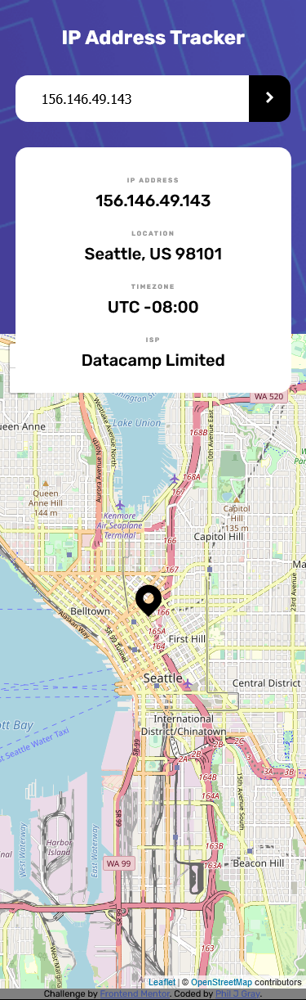

# Frontend Mentor - IP address tracker solution

This is a solution to the [IP address tracker challenge on Frontend Mentor](https://www.frontendmentor.io/challenges/ip-address-tracker-I8-0yYAH0). Frontend Mentor challenges help you improve your coding skills by building realistic projects.

## Table of contents

- [Overview](#overview)
  - [The challenge](#the-challenge)
  - [Screenshot](#screenshot)
  - [Links](#links)
- [My process](#my-process)
  - [Built with](#built-with)
  - [What I learned](#what-i-learned)
  - [Continued development](#continued-development)
  - [Useful resources](#useful-resources)
- [Author](#author)

**Note: Delete this note and update the table of contents based on what sections you keep.**

## Overview

### The challenge

Users should be able to:

- View the optimal layout for each page depending on their device's screen size
- See hover states for all interactive elements on the page
- See their own IP address on the map on the initial page load
- Search for any IP addresses or domains and see the key information and location

### Screenshot




### Links

- Solution URL: [https://github.com/PhilJG/ip-address-tracker](https://github.com/PhilJG/ip-address-tracker)
- Live Site URL: [https://philjg.github.io/ip-address-tracker/](https://philjg.github.io/ip-address-tracker/)

## My process

### Built with

- Semantic HTML5 markup
- CSS custom properties
- Flexbox
- Fetch API Promises
- Lefily API
- Geo ipify mapping API

### What I learned

Continue from the previous project I increased the complexity of my API calls using two different APIs.

```js
const myIcon = L.icon({
  iconUrl: "icon-location.svg",
  iconSize: [32, 40],
  iconAnchor: [22, 94],
  popupAnchor: [-3, -76],
});
const map = L.map("map").setView([0, 0], 10);
const marker = L.marker([0, 0], { icon: myIcon }).addTo(map);

const attribution =
  '&copy; <a href="https://www.openstreetmap.org/copyright">OpenStreetMap</a> contributors';

const tileUrl = "https://{s}.tile.openstreetmap.org/{z}/{x}/{y}.png";
const tiles = L.tileLayer(tileUrl, { attribution });
tiles.addTo(map);

const fetchIPAddress = function () {
  fetch(`https://api.ipify.org?format=json`)
    .then((res) => res.json())
    .then((data) => {
      IPInput.value = data.ip;
      fetchIPDetails();
    });
};

const fetchIPDetails = function () {
  fetch(
    `https://geo.ipify.org/api/v2/country,city?apiKey=at_SM7nf8Ww601CicFfwIsuIwIqzobxE&ipAddress=${IPValue}`
  )
    .then((res) => res.json())
    .then(function (data) {
      console.log(data);
      IPaddress.textContent = data.ip;
      locationOutput.textContent = `${data.location.city}, ${data.location.country} ${data.location.postalCode}`;
      timeOutput.textContent = `UTC ${data.location.timezone}`;
      ISPOutput.textContent = `${data.isp}`;
      marker.setLatLng([`${data.location.lat}`, `${data.location.lng}`]);
      map.setView([`${data.location.lat}`, `${data.location.lng}`], 13);
    });
};
```

### Continued development

I`m enjoying API's and will continue to work more with them in upcoming projects

### Useful resources

- [The coding train - 1.5 Mapping Geolocation with Leaflet.js - Working with Data and APIs in JavaScript](https://www.youtube.com/watch?v=nZaZ2dB6pow) - This was almost exactly what I was looking for.

## Author

- Website - [Phil J Gray](https://www.philjgray.ca)
- Frontend Mentor - [@PhilJG](https://www.frontendmentor.io/profile/PhilJG)
- Twitter - [@yourusername](https://www.twitter.com/yourusername)
